<div align="center">


<h1>FinOps Policy as Code (FPAC)</h1>

<p><strong>The Global Standard for Industrialized Cloud Cost Governance and Automated Remediation</strong></p>

[]()
[]()
[]()
[]()

<br/>

> **"Industrializing cloud cost governance to automate guardrails, govern spend, and accelerate autonomous optimization across the enterprise."** 
> FinOps Policy as Code (FPAC) is a flagship repository designed to enable organizations to define, enforce, and automate cloud cost policies through Open Policy Agent (OPA), institutional frameworks, and multi-cloud remediation workflows.

</div>

---

## 🏛️ Executive Summary

**FinOps Policy as Code (FPAC)** is a flagship repository designed for CIOs, CFOs, and Platform Leaders. As cloud estates scale across multiple providers and thousands of resources, manual cost governance is no longer viable. FPAC transitions organizations from "Manual Reviews" to "Industrialized Governance," where cost guardrails are embedded directly into the engineering lifecycle.

This platform provides an industrialized approach to **Cloud Financial Governance**, delivering production-ready **Policy Engines**, **Automated Remediators**, **Compliance Analytics**, and **Executive Scorecards**. It enables organizations to enforce preventive controls at the point of provisioning (IaC) and detective controls across the live estate, ensuring continuous financial integrity and value realization.

---

## 💡 Why FinOps Policy-as-Code Matters

FPAC is the "financial guardrail" of the modern cloud-native organization:
- **Preventive Guardrails**: Stopping expensive or non-compliant resources before they are even deployed (via Terraform/OPA).
- **Detective Remediation**: Automatically identifying and fixing (e.g., stopping/rightsizing) idle or oversized resources in real-time.
- **Institutional Consistency**: Enforcing the same cost standards across Azure, AWS, GCP, and Kubernetes without provider-specific complexity.
- **Engineering Accountability**: Providing developers with immediate, code-centric feedback on the financial impact of their infrastructure changes.

---

## 🚀 Business Outcomes

### 🎯 Strategic Governance Impact
- **Elimination of "Bill Shock"**: Enforcing budget-aware guardrails that block deployments exceeding regional or team quotas.
- **Guaranteed Compliance**: Ensuring 100% adherence to tagging and metadata standards for accurate chargeback/showback.
- **Autonomous Optimization**: Driving 15-25% savings through automated "Orphan Cleanup" and "Idle Resource Shutdown" workflows.
- **Improved Engineering Efficiency**: Reducing "Governance Friction" by automating the approval of standard, cost-optimized architectures.

---

## 🏗️ Technical Stack

| Layer | Technology | Rationale |
|---|---|---|
| **Policy Engine** | OPA (Open Policy Agent) | Universal, platform-agnostic standard for defining cost policies as structured code. |
| **Orchestration** | Python (FastAPI) | High-performance gateway for policy evaluation, remediation tracking, and analytics. |
| **Infrastructure** | Terraform | Policy-as-Code integration for preventive gates and infrastructure foundations. |
| **Frontend** | React 18, Vite | Premium portal for executive dashboards, policy compliance heatmaps, and exception management. |
| **Automation** | GitHub Actions | CI/CD for policy validation, deployment, and automated remediation schedules. |

---

## 📐 Architecture Storytelling: 95+ Diagrams

### 1. Executive High-Level Architecture
The holistic vision of the enterprise FinOps policy-as-code journey.

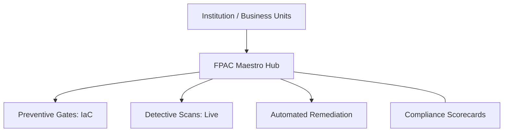

### 2. Detailed Platform Topology
The internal service boundaries and management layers of the industrialized FPAC platform.

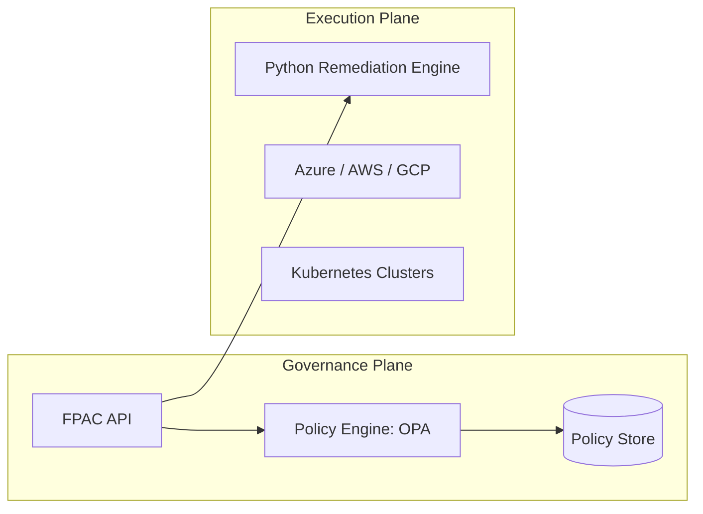

### 3. Billing Data to Policy Action Path
Tracing the path from a spend event to an automated governance remediation.

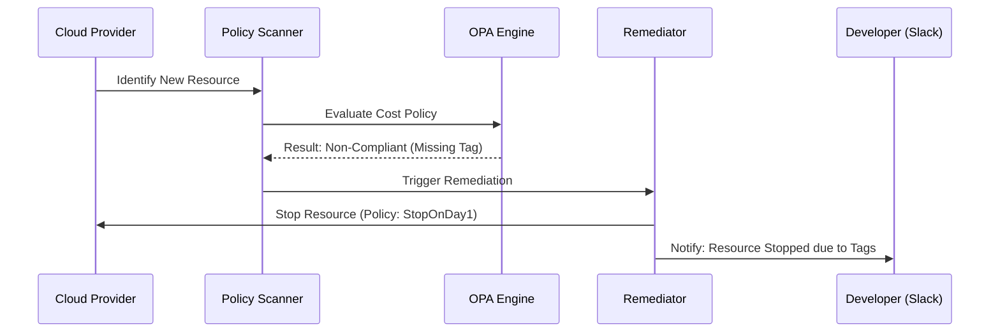

### 4. FinOps Control Plane
The "Brain" of the framework managing global institutional standards and automated exception workflows.

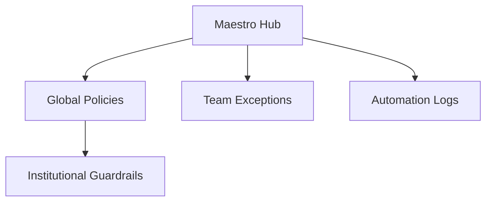

### 5. Multi-Cloud Topology
Synchronizing institutional cost policies across Azure, AWS, and GCP for a unified governance estate.

```mermaid
graph LR
    Azure[Azure Policy] <-> Bridge[FPAC Sync] <-> AWS[AWS SCP/Config]
    Bridge <-> GCP[GCP Org Policy]
```

### 6. Regional Deployment Model
Hosting governance nodes close to global engineering hubs for localized scanning and reporting.

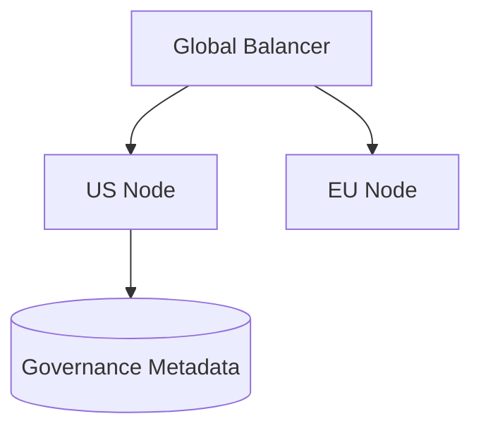

### 7. DR Failover Model
Ensuring platform continuity for critical cost guardrails and remediation audit trails.

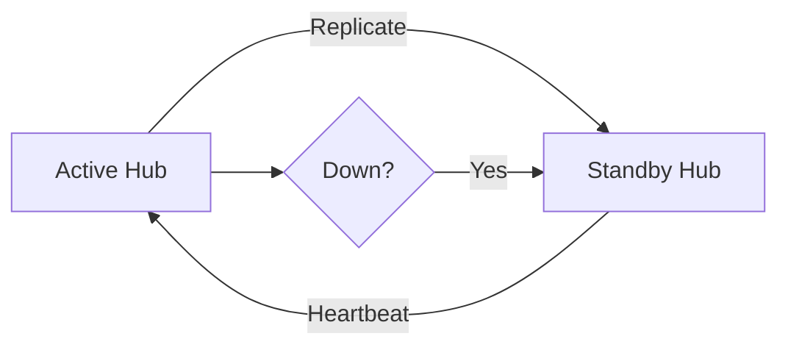

### 8. API Gateway Architecture
Securing and throttling the entry point for policy evaluation and remediation requests.

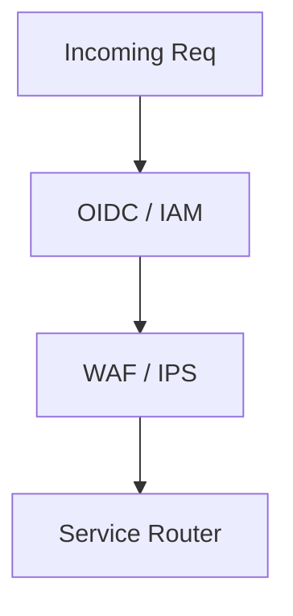

### 9. Queue Worker Architecture
Managing long-running policy scans, remediation tasks, and report generation.

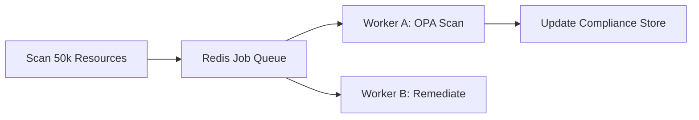

### 10. Dashboard Analytics Flow
How raw governance telemetry becomes executive institutional compliance heatmaps.

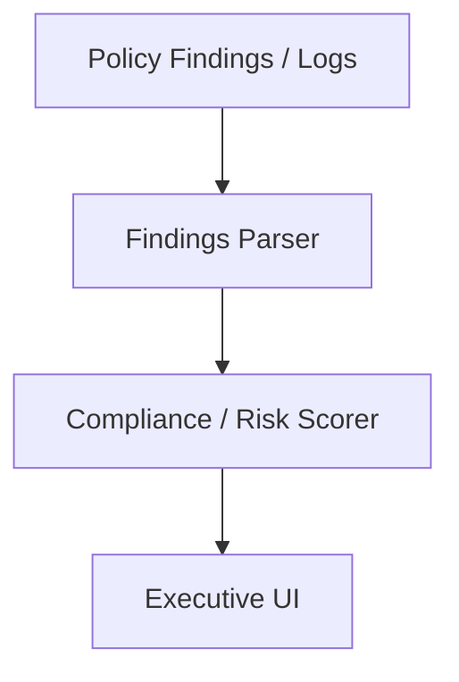

### 11. Preventive Control Workflow
Stopping non-compliant or expensive deployments before they reach production.

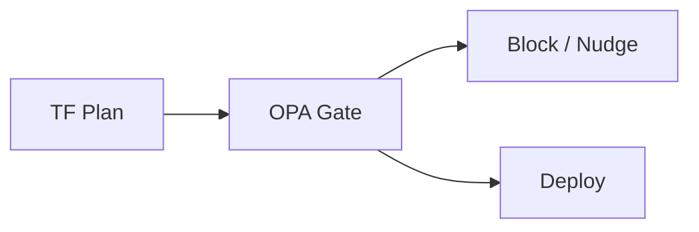

### 12. Detective Control Workflow
Identifying policy drift and cost anomalies in existing live cloud resources.

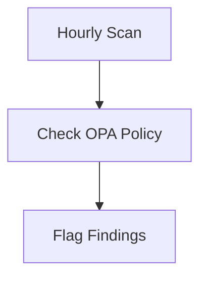

### 13. Corrective Control Lifecycle
The automated path from identifying a violation to verified remediation.

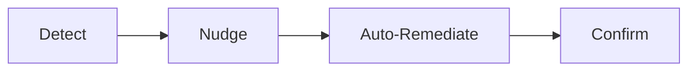

### 14. Policy Hierarchy Model
Organizing cost policies into Global, Business Unit, and Application Team layers.

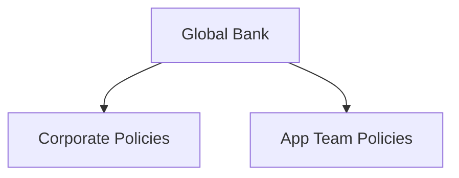

### 15. Exception Approval Process
The formal workflow for granting temporary cost policy waivers for critical workloads.

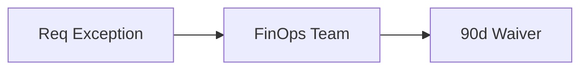

### 16. Waiver Lifecycle Model
Managing the automated expiration and renewal cycle of policy exceptions.

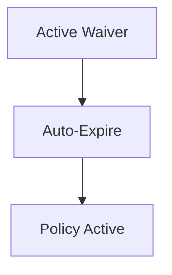

### 17. Policy Ownership Matrix
Defining which institutional stakeholders own specific FinOps cost policies.

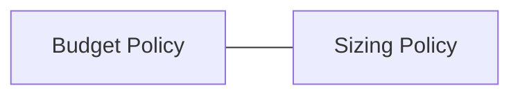

### 18. Quarterly Review Cadence
The rhythm of auditing and evolving the enterprise policy library.

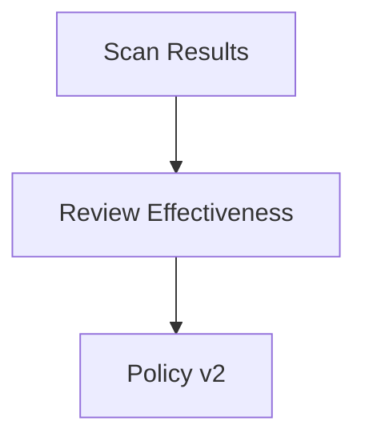

### 19. Policy Release Workflow
The CI/CD pipeline for testing and deploying new Open Policy Agent (OPA) rules.

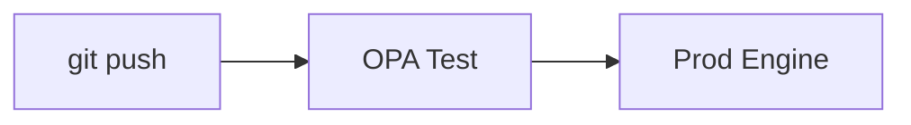

### 20. Control Evidence Model
Generating the necessary proof for financial auditors regarding cost governance.

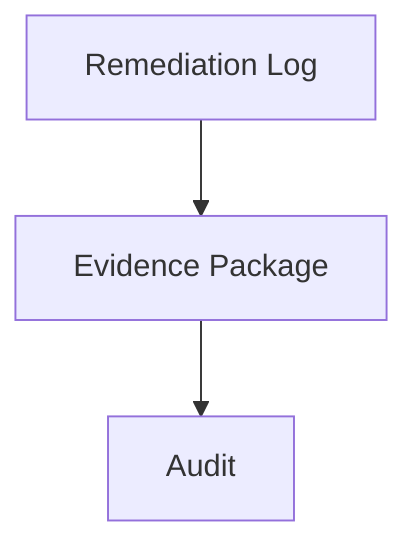

### 21. Budget Threshold Enforcement
Automating the notification and suspension of services approaching budget limits.

```mermaid
graph LR
    usage[80%] --> Nudge[Alert Team]
    usage[100%] --> Action[Block Provisioning]
```

### 22. Spend Anomaly Remediation
The automated response playbook for unexpected spikes in cloud provider spend.

```mermaid
graph TD
    Spike[+500%] --> Triage[AI Root Cause] --> Action[Isolate/Stop]
```

### 23. Team Quota Model
Enforcing hard and soft limits on regional and service-specific consumption.

```mermaid
graph LR
    Limit[50 VMs] <-> Actual[48 VMs] --> Warning[Near Limit]
```

### 24. Shared Cost Allocation Flow
Governing the fair distribution of common cloud costs using policy-based tags.

```mermaid
graph TD
    Shared[Shared Support] --> Alloc[Pro-rata Policy] --> Team[Team Bill]
```

### 25. Forecast Breach Alert Model
Predicting future policy violations based on current consumption trends.

```mermaid
graph LR
    Trend[Current Trend] --> AI[Forecast] --> Alert[Budget Risk]
```

### 26. Idle Resource Shutdown Flow
Automatically stopping non-production VMs and DBs outside of business hours.

```mermaid
graph TD
    7PM[7 PM] --> Scan[Find Dev VMs] --> Stop[Stop All]
```

### 27. Rightsizing Recommendation Workflow
The path from performance telemetry to automated instance size adjustments.

```mermaid
graph LR
    Metrics[5% CPU] --> Suggest[Downsize] --> Apply[Update Size]
```

### 28. Storage Lifecycle Optimization
Enforcing policies for moving aged data to lower-cost archival tiers.

```mermaid
graph TD
    Data[30d Old] --> Policy[Move to Cold] --> Save[90% Cost Reduction]
```

### 29. Network Egress Control Model
Identifying and blocking high-cost cross-region data transfers using OPA.

```mermaid
graph LR
    Source[US-East] --> Dest[EU-West] --> Block[Expensive Path]
```

### 30. Cost Center Mapping Lifecycle
Ensuring every resource is linked to an active institutional cost center.

```mermaid
graph TD
    Res[Resource] --> Validate[ERP Link] --> Tag[Approved Tag]
```

### 31. RI / Savings Plan Governance
Automating the monitoring and reporting of commitment-based discount coverage.

```mermaid
graph LR
    Actual[80%] <-> Target[95%] --> Gap[Purchase Alert]
```

### 32. Reservation Coverage Workflow
Identifying underutilized reservations and suggesting exchanges.

```mermaid
graph TD
    RI[Idle RI] --> Exchange[Swap to Active Type] --> Save[Efficiency]
```

### 33. Utilization Benchmark Model
Comparing commitment utilization scores across different business units.

```mermaid
graph LR
    BU_A[98%] <-> BU_B[45%] --> Action[Reallocate]
```

### 34. Procurement Approval Flow
Integrating cloud commitment purchases into the corporate approval cycle.

```mermaid
graph TD
    Req[Commitment Req] --> FinOps[Verify] --> CFO[Approve]
```

### 35. Renewal Calendar Model
Tracking the expiration dates of all cloud provider and SaaS commitments.

```mermaid
graph LR
    Jan[Azure RI Exp] --- Mar[Datadog Exp] --- Dec[EDP Exp]
```

### 36. Marketplace Control Workflow
Governing 3rd party software purchases made via cloud provider marketplaces.

```mermaid
graph TD
    Purchase[Buy SaaS] --> Policy[Check Budget] --> Allow[Procure]
```

### 37. SaaS License Governance
Automatically deprovisioning inactive SaaS accounts to save licensing costs.

```mermaid
graph LR
    90d[90d Inactive] --> Notify[Revoke?] --> Deprovision[Account Delete]
```

### 38. Vendor Negotiation Support Model
Using policy-based compliance data to drive better pricing in renewals.

```mermaid
graph TD
    Data[Usage Stats] --> Negotiate[Better EDP Terms]
```

### 39. Contract Benchmark Workflow
Comparing current cloud contract terms against industry standards using policy.

```mermaid
graph LR
    Contract[Our Terms] <-> Benchmark[Peer Data]
```

### 40. Commitment Maturity Roadmap
The journey from "On-Demand" to "95%+ Optimized Commitment Coverage."

```mermaid
graph LR
    Phase1[Visibility] --> Phase3[Elite Commit]
```

### 41. Azure Policy Enforcement Model
Synchronizing FPAC Open Policy Agent rules with native Azure Policy sets.

```mermaid
graph LR
    FPAC[OPA Hub] --> Azure[Native Policy] --> Sub[Managed Sub]
```

### 42. AWS SCP Governance Flow
Mapping cost guardrails to AWS Service Control Policies (SCPs) at scale.

```mermaid
graph TD
    Policy[Block GPU] --> SCP[AWS Org Policy] --> Account[Blocked]
```

### 43. AWS Config Detective Model
Leveraging AWS Config for real-time cost-related resource state changes.

```mermaid
graph LR
    Change[New EBS] --> Config[Check Snapshot] --> Delete[Orphan Delete]
```

### 44. GCP Org Policy model
Enforcing cost-constrained project creation via GCP Organizational Policies.

```mermaid
graph TD
    Org[Org Root] --> Policy[Cost Constraint] --> Proj[Regulated Project]
```

### 45. Kubernetes Admission Control
Blocking expensive K8s resource requests using OPA Gatekeeper.

```mermaid
graph LR
    Request[Pod] --> Webhook[OPA Gatekeeper] --> Reject[No Quota]
```

### 46. Namespace Quota Workflow
Automating the lifecycle of namespace-level cost and resource limits.

```mermaid
graph TD
    Team[New Team] --> Provision[NS with Quota] --> Manage[Autoscale]
```

### 47. Terraform Policy Gate
The "Shift-Left" mechanism for stopping expensive infra changes in CI/CD.

```mermaid
graph LR
    PR[Pull Request] --> Plan[TF Plan] --> FPAC[OPA Gate] --> Merge[Deploy]
```

### 48. CI/CD Spend Guardrail model
Enforcing limits on ephemeral environment costs in GitHub Actions / GitLab.

```mermaid
graph TD
    Runner[New Runner] --> Policy[Max 2hr Life] --> Cleanup[Auto-Kill]
```

### 49. Secrets Management Workflow
Securing policy credentials and remediation service accounts in vaults.

```mermaid
graph LR
    Engine[Engine] --> Vault[Get Secret] --> Cloud[Remediate]
```

### 50. Multi-account Landing Zone Flow
Integrating cost policies into the standard account vending machine process.

```mermaid
graph TD
    New[New Account] --> Baseline[FPAC Guardrails] --> Live[Governed]
```

### 51. OIDC / SSO Auth Flow
Securing the FPAC control plane with institutional identity providers.

```mermaid
graph LR
    User[FinOps Lead] --> SSO[Entra ID] --> Portal[FPAC UI]
```

### 52. RBAC Model
Defining granular roles for Policy Authors, Auditors, and App Owners.

```mermaid
graph TD
    Role[Auditor] --> Perm[Read-Only Policies]
```

### 53. Audit Logging Architecture
Capturing every policy change and remediation action for institutional records.

```mermaid
graph LR
    Action[Stop VM] --> Log[Activity Store] --> SIEM[Sentinel]
```

### 54. Metrics Pipeline
The automated flow for capturing and scoring institutional policy compliance.

```mermaid
graph TD
    Ingest[Scans] --> Scorer[Compliance Engine] --> Metric[Prometheus]
```

### 55. Logging Architecture
The multi-layered approach to capturing platform logs and traces.

```mermaid
graph LR
    App[App] --- OS[OS] --- Cloud[Provider]
```

### 56. Tracing Model
Observing the distributed execution of remediation tasks across regions.

```mermaid
graph TD
    Job[Remediate All] --> SvcA[Gate] --> SvcB[Cloud API]
```

### 57. Incident Response Workflow
The automated playbook for responding to critical policy bypasses.

```mermaid
graph LR
    Alert[Bypass] --> Triage[T1 SOC] --> Resolve[Enforce]
```

### 58. Data Retention Governance
Enforcing policies for the lifecycle of historical governance and spend logs.

```mermaid
graph TD
    Log[Fresh] --> 1yr[Archive] --> 7yr[Delete]
```

### 59. Change Management Lifecycle
The institutional process for updating global cost policies.

```mermaid
graph LR
    Propose[Propose] --> CAB[Review] --> Release[Deploy]
```

### 60. Backup Recovery Model
Ensuring the resilience of the central policy and compliance metadata.

```mermaid
graph TD
    Primary[Live] --> Backup[Off-site] --> Verify[Test Restore]
```

### 61. Executive KPI Review Cycle
Providing the C-suite with a unified view of governance efficiency and savings.

```mermaid
graph TD
    Stats[Savings Data] --> Board[Executive Deck]
```

### 62. Savings Scorecard
Visualizing total savings realized through automated remediations vs manual.

```mermaid
graph LR
    Auto[$1.2M] <-> Manual[$300k] --> Win[Efficiency Gain]
```

### 63. Policy Compliance Heatmap
Identifying the "High Risk" business units with low policy compliance scores.

```mermaid
graph TD
    Green[Compliant BU] --- Red[Risk BU]
```

### 64. Team Benchmark Comparison
Gamifying FinOps governance by comparing compliance scores between app teams.

```mermaid
graph LR
    TeamA[Leader] <-> TeamB[Lagging]
```

### 65. Unit Economics Dashboard
Mapping policy-governed costs to specific units of business value.

```mermaid
graph TD
    Policy[Rightsized] --> CostPerCust[Lower Unit Cost]
```

### 66. Monthly Close Reporting Flow
Automating the month-end reconciliation of policy-governed spend.

```mermaid
graph LR
    Bill[Bill] --> Accrual[Accrual] --> Final[Gov Report]
```

### 67. Board Reporting Model
Communicating FinOps governance strategy and risk to the non-technical board.

```mermaid
graph TD
    Strategy[Strategy] --> Value[Outcome]
```

### 68. PMO Operating Cadence
The institutional structure for managing the FinOps policy roadmap.

```mermaid
graph LR
    PMO[PMO] --- Review[Review Meetings]
```

### 69. FinOps Maturity Roadmap
The journey from "Ad-hoc Cost Governance" to "Autonomous Optimization."

```mermaid
graph LR
    Start[Visibility] --> Elite[Autonomous]
```

### 70. Continuous Improvement Loop
The engine for evolving the policy library based on real-world savings data.

```mermaid
graph LR
    Retro[Retro] --> Policy[Policy Update]
```

### 71. AI Policy Advisor Flow
Leveraging LLMs to suggest new cost policies based on spend patterns.

```mermaid
graph TD
    Scan[Analyze Spend] --> AI[AI Advice] --> Policy[New Rule]
```

### 72. Autonomous Remediation Engine
The self-healing mechanism that fixes cost violations without human intervention.

```mermaid
graph LR
    Detect[Detect] --> Engine[Auto-Fix] --> Notify[Confirm]
```

### 73. Multi-country Operating Model
Governing cost policies across different regulated jurisdictions and currencies.

```mermaid
graph TD
    Global[Admin] --> Local[Local Compliance]
```

### 74. M&A Spend Integration Flow
Rapidly onboarding and governing the cloud spend of acquired companies.

```mermaid
graph LR
    Acq[Acquisition] --> Audit[Policy Audit] --> Peer[Merge]
```

### 75. Carbon + Cost Optimization Model
Identifying "Green Optimization" targets that reduce both spend and carbon.

```mermaid
graph TD
    Save[Cost] <-> Green[Carbon Metric]
```

### 76. Real-time Spend Streaming Model
Providing sub-second visibility into policy-governed cloud spend.

```mermaid
graph LR
    Event[Spend Event] --> Stream[Kafka] --> Dash[Real-time]
```

### 77. Developer Nudging Workflow
Automating the "soft enforcement" of policies via Slack/Jira.

```mermaid
graph TD
    Violation[Violation] --> Nudge[Slack Message] --> Fix[Fix Commit]
```

### 78. Sovereign Cloud Billing Model
Managing cost governance for mission-critical services with zero foreign access.

```mermaid
graph LR
    Zone[Sovereign] --> LocalGov[Governed]
```

### 79. Innovation Portfolio Roadmap
Planning the next 36 months of policy-as-code evolution and AI features.

```mermaid
graph TD
    Now[Now] --> Year3[Future]
```

### 80. Strategic Transformation Timeline
The institutional mission to modernize every financial guardrail in the cloud.

```mermaid
graph LR
    Phase1[Setup] --> Phase3[Scale]
```

### 81. Terraform Provisioning Workflow
The automated path for creating and updating global governance spokes.

```mermaid
graph LR
    Plan[Plan] --> Apply[Apply] --> Live[Governed Spoke]
```

### 82. Queue Processing Lifecycle
Ensuring high-availability for background policy scans and reports.

```mermaid
graph TD
    Task[Job] --> Worker[Process] --> Success[Done]
```

### 83. ERP Integration Workflow
Synchronizing policy metadata with corporate finance systems (SAP/Oracle).

```mermaid
graph TD
    FPAC[FPAC Hub] --> ERP[SAP] --> Accounting[Ledger]
```

### 84. CMDB Sync Model
Linking cloud resources to the corporate Configuration Management Database.

```mermaid
graph LR
    Cloud[Resource] <-> CMDB[System ID]
```

### 85. SaaS Telemetry Ingestion
Capturing and analyzing usage data from SaaS providers for policy review.

```mermaid
graph TD
    SaaS[API] --> Usage[Process] --> Policy[Rationalize]
```

### 86. Tenant Baseline Comparison
Auditing individual business units against the "Gold Standard" policy baseline.

```mermaid
graph TD
    Gold[Gold] <-> BU[Business Unit]
```

### 87. KPI Data Lineage Model
Tracing the flow of compliance metrics from raw scan to board report.

```mermaid
graph LR
    Scan[Scan] --> Metric[Prometheus] --> Report[Slide]
```

### 88. Policy Drift Detection Flow
Continuously validating that live guardrails match the "As-Code" definition.

```mermaid
graph TD
    Live[Live] <-> State[Git State] --> Alert[Drift!]
```

### 89. Resource Orphan Cleanup Model
Automating the identifying and deleting of unused storage, IPs, and snapshots.

```mermaid
graph LR
    Scan[Scan Orphans] --> Policy[Delete if 7d] --> Save[Save $]
```

### 90. Global FinOps Hub Model
The institutional structure for 24/7 global policy operations.

```mermaid
graph LR
    Follow[Follow the Sun] --- PMO[FPAC Center]
```

### 91. Chargeback Approval Flow
Governing the movement of funds based on policy-governed cloud consumption.

```mermaid
graph TD
    Spend[Spend] --> Review[Policy Check] --> Transfer[Move Funds]
```

### 92. Data Quality Workflow
Automating the verification of billing and policy metadata integrity.

```mermaid
graph LR
    Data[Data] --> Valid[Check Quality] --> Proceed[Process]
```

### 93. Multi-cloud Score Aggregation
Normalizing compliance scores across different cloud provider engines.

```mermaid
graph TD
    Azure[80%] + AWS[90%] --> Global[85% Agg]
```

### 94. Executive Exception Review
The formal process for C-level review of high-value cost policy exceptions.

```mermaid
graph LR
    HighCost[High Exp] --> Board[Exec Review] --> Allow[Policy Waiver]
```

### 95. Regional Benchmark Comparison
Comparing the governance efficiency of different global operating regions.

```mermaid
graph TD
    US[US: High] <-> EU[EU: Moderate]
```

---

## 🔬 FinOps Governance Methodology

### 1. The FPAC Pillars
Our platform is built on four core pillars:
- **Prevention**: Stopping waste before it starts through "Shift-Left" guardrails.
- **Detection**: Continuously scanning for drift, anomalies, and optimization gaps.
- **Remediation**: Automating the fix to ensure savings are realized, not just identified.
- **Evidence**: Providing the immutable audit trail for institutional compliance.

### 2. Policy-as-Code Strategy
We provide a strategic framework for mapping financial controls to structured OPA rules across the multi-cloud estate.

---

## 🚦 Getting Started

### 1. Prerequisites
- **Azure + AWS + GCP** access.
- **Terraform** (latest version).
- **Python** (3.11+) for the remediation engine.

### 2. Local Setup
```bash
# Clone the repository
git clone https://github.com/Devopstrio/finops-policy-as-code.git
cd finops-policy-as-code

# Start the Governance Control Plane
docker-compose up --build
```
Access the Portal at `http://localhost:3000`.

---

## 🛡️ Governance & Security
- **Policy by Design**: Deep integration with institutional financial guardrails.
- **Audit Ready**: Built-in evidence generation for regulators and auditors.
- **Zero Trust**: Enforcing identity-based access for all remediation workflows.

---
<sub>&copy; 2026 Devopstrio &mdash; Engineering the Future of Industrialized FinOps Policy as Code.</sub>
