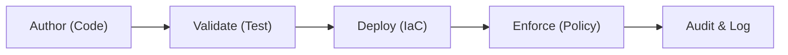
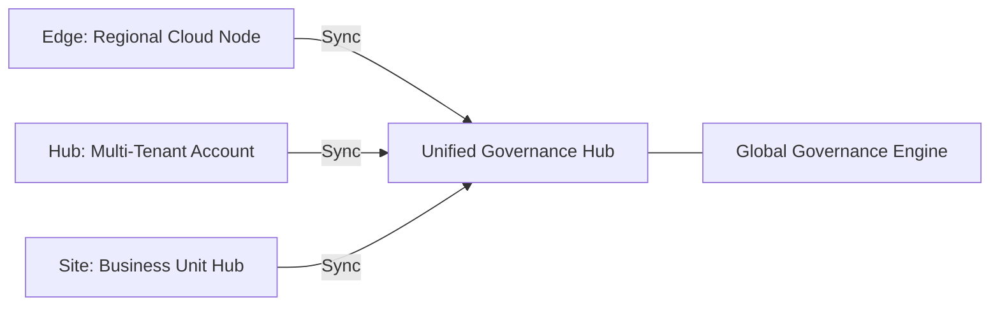
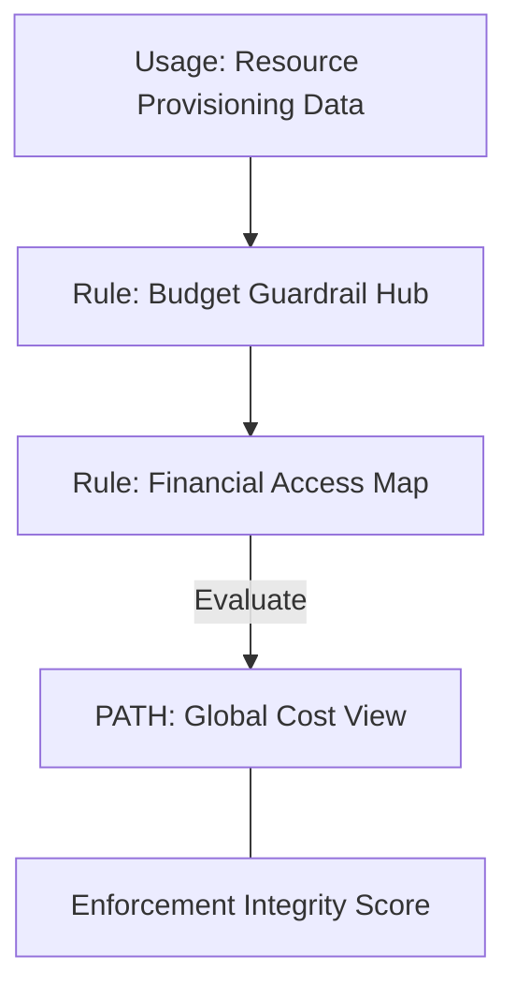
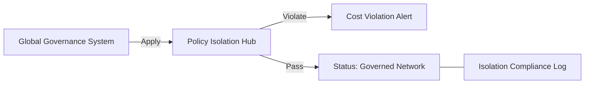
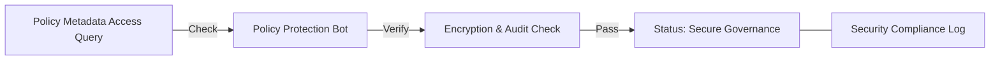
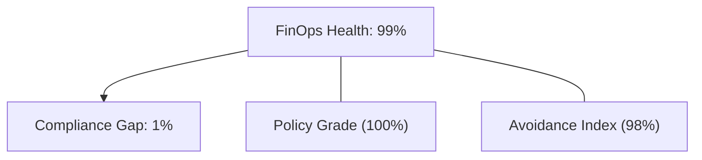
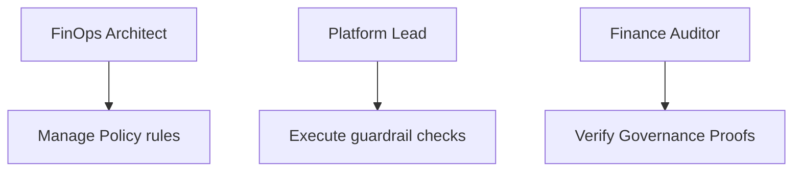
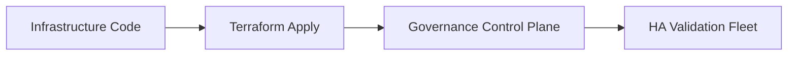
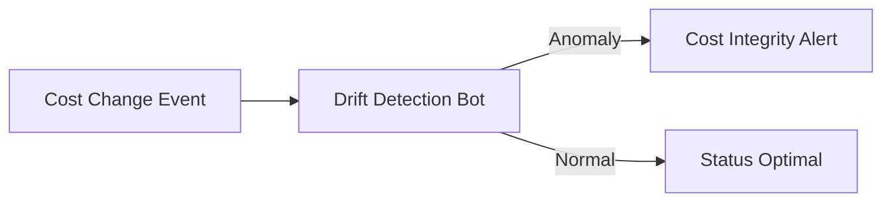
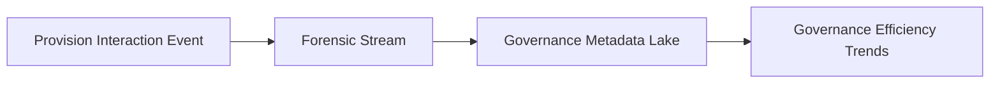

<div align="center">


<h1>FinOps Policy as Code</h1>

<p><strong>The Institutional-Grade Platform for Cloud Cost Governance, Automated Remediation, and Multi-Cloud Financial Guardrail Orchestration.</strong></p>

[]()
[]()
[]()

<br/>

> **"Industrializing cost governance to automate financial guardrails."** 
> **FinOps Policy as Code** is an enterprise-grade platform designed to provide a secure, measurable, and highly automated foundation for global cloud governance operations. It orchestrates the complex lifecycle of cost policies—from code-driven authoring and impact analysis to distributed multi-cloud enforcement and unified financial auditing.

</div>

---

## 🏛️ Executive Summary

Fragmented governance silos and manual cost review workflows are strategic operational liabilities; lack of centralized cost orchestration is a primary barrier to organizational FinOps maturity. Organizations fail to maintain a secure financial foundation not because of a lack of policies, but because of fragmented governance standards, lack of automated enforcement validation, and an inability to orchestrate cost planes with operational precision.

This platform provides the **Cost Governance Intelligence Plane**. It implements a complete **Enterprise FinOps-Policy-as-Code Framework**, enabling Finance and Platform teams to manage global cloud guardrails as first-class citizens. By automating the identification of budget bottlenecks through real-time telemetry analysis and orchestrating the deployment of secure enforcement-driven cost policies, we ensure that every organizational service—from core developer sandboxes to distributed production workloads—is governed by default, audited for history, and strictly aligned with institutional financial frameworks.

---

## 📐 Architecture Storytelling: Principal Reference Models

### 1. Principal Architecture: Global FinOps Policy-as-Code & Cost Governance Intelligence Plane
This diagram illustrates the end-to-end flow from code-driven policy ingestion and multi-cloud orchestration to guardrail enforcement, safety validation, and institutional financial auditing.


```mermaid
graph LR
    %% Subgraph Definitions
    subgraph PolicyIngress["FinOps Code & Guardrail Ingress"]
        direction TB
        Security_Code["Open Policy Agent (OPA) / Rego"]
        Compliance_Rules["Budget / Tagging / Sizing Baselines"]
        Governance_Feeds["Real-time Cloud Provider Intel"]
    end

    subgraph IntelligenceEngine["Cost Governance Intelligence Hub"]
        direction TB
        API["FastAPI Policy Gateway"]
        PolicyOrchestrator["Global Policy & Guardrail Hub"]
        EnforcementGuard_Hub["Remediation & Boundary Hub"]
        AIOps_Validator["Violation & Drift Analysis Hub"]
    end

    subgraph OperationsPlane["Distributed Multi-Cloud Fleet"]
        direction TB
        AzurePolicy["Managed Azure Policy Hubs"]
        AWSSCP["Managed AWS SCP Hubs"]
        GCPOrgPolicy["Managed GCP Org Hubs"]
    end

    subgraph OperationsHub["Institutional Finance Hub"]
        direction TB
        Scorecard["FinOps Maturity Scorecard"]
        Analytics["Violation Flow & Avoidance Stats"]
        Audit["Forensic Cost Metadata Lake"]
    end

    subgraph DevOps["FinOps-Policy-as-Code Framework"]
        direction TB
        TF["Terraform Governance Modules"]
        DriftBot["Policy & Config Drift Validator"]
        ChatOps["FinOps Operations Hub"]
    end

    %% Flow Arrows
    PolicyIngress -->|1. Submit Policy| API
    API -->|2. Orchestrate Guardrail| PolicyOrchestrator
    PolicyOrchestrator -->|3. Apply Enforcement Policy| EnforcementGuard_Hub
    EnforcementGuard_Hub -->|4. Assess Drift| AIOps_Validator
    
    AIOps_Validator -->|5. Execute Provision| OperationsPlane
    OperationsPlane -->|6. Notify Status| ChatOps
    API -->|7. Visualize Health| Scorecard
    
    Scorecard -->|8. Track Maturity| Analytics
    Scorecard -->|9. Record Provision| Audit
    
    TF -->|10. Provision Backbone| IntelligenceEngine
    DriftBot -->|11. Inject Cost Risk| PolicyOrchestrator
    Audit -->|12. Improve Operations| AzurePolicy

    %% Styling
    classDef ingress fill:#f5f5f5,stroke:#616161,stroke-width:2px;
    classDef intel fill:#e8eaf6,stroke:#1a237e,stroke-width:2px;
    classDef operations fill:#e1f5fe,stroke:#01579b,stroke-width:2px;
    classDef ops fill:#ede7f6,stroke:#311b92,stroke-width:2px;
    classDef devops fill:#e8f5e9,stroke:#1b5e20,stroke-width:2px;

    class PolicyIngress ingress;
    class IntelligenceEngine intel;
    class OperationsPlane operations;
    class OperationsHub ops;
    class DevOps devops;
```

### 2. The FinOps Policy Lifecycle Flow
The continuous path of a cost governance policy from initial author (code) and validate (lint/test) to active deploy (IaC), enforce (policy), and institutional forensic auditing.


```mermaid
graph LR
    Author["Author (Code)"] --> Validate["Validate (Test)"]
    Validate --> Deploy["Deploy (IaC)"]
    Deploy --> Enforce["Enforce (Policy)"]
    Enforce --> Audit["Audit & Log"]
```

### 3. Distributed Cost Governance Topology
Strategically orchestrating FinOps policies across global cloud regions, multi-tenant accounts, and internal business units, providing a unified institutional view of global cloud health and policy readiness.


```mermaid
graph LR
    Regional["Edge: Regional Cloud Node"] -->|Sync| Hub["Unified Governance Hub"]
    Account["Hub: Multi-Tenant Account"] -->|Sync| Hub
    BU["Site: Business Unit Hub"] -->|Sync| Hub
    Hub --- Logic["Global Governance Engine"]
```

### 4. Cost Guardrails & Budget Enforcement Flow
Executing complex logic for securing the bridge between resource provisioning and institutional financial boundaries, ensuring every organizational identity is verified and every cost access is according to institutional standards.


```mermaid
graph TD
    Provision["Usage: Resource Provisioning Data"] --> Bridge["Rule: Budget Guardrail Hub"]
    Bridge --> BoundaryMap["Rule: Financial Access Map"]
    BoundaryMap -->|Evaluate| Context["PATH: Global Cost View"]
    Context --- Estimate["Enforcement Integrity Score"]
```

### 5. Multi-Cloud FinOps Federation & Governance Flow
Automatically managing unified cost policies across Azure Policy, AWS Service Control Policies (SCPs), and GCP Organization Policies, ensuring institutional data residency and security boundaries by default.


```mermaid
graph LR
    Org["Global Governance System"] -->|Apply| Guard["Policy Isolation Hub"]
    Guard -->|Violate| Alert["Cost Violation Alert"]
    Guard -->|Pass| Verify["Status: Governed Network"]
    Verify --- Audit["Isolation Compliance Log"]
```

### 6. Encryption & Data Plane Protection Flow (Security Standard)
Managing the lifecycle of a policy record, automatically enforcing institutional security standards for policy metadata and audit logs as required by security policy, ensuring zero-latency security confidence.


```mermaid
graph LR
    PolicyData["Policy Metadata Access Query"] -->|Check| Gatekeeper["Policy Protection Bot"]
    Gatekeeper -->|Verify| AES["Encryption & Audit Check"]
    AES -->|Pass| Admit["Status: Secure Governance"]
    Admit --- Audit["Security Compliance Log"]
```

### 7. Institutional FinOps Maturity Scorecard
Grading organizational performance based on key indicators: Policy Coverage Grade, Automated Remediation Index, and Cost Avoidance Index.


```mermaid
graph TD
    Post["FinOps Health: 99%"] --> Risk["Compliance Gap: 1%"]
    Post --- C1["Policy Grade (100%)"]
    Post --- C2["Avoidance Index (98%)"]
```

### 8. Identity & RBAC for FinOps Governance
Managing fine-grained access to governance hubs, provisioning workers, and audit logs between FinOps Architects, Cloud Platform Leads, and Financial Auditors.


```mermaid
graph TD
    Architect["FinOps Architect"] --> Hub["Manage Policy rules"]
    Lead["Platform Lead"] --> Exec["Execute guardrail checks"]
    Auditor["Finance Auditor"] --> Audit["Verify Governance Proofs"]
```

### 9. IaC Deployment: FinOps-Policy-as-Code Framework
Using modular Terraform to deploy and manage the versioned distribution of the governance tracking hubs, remediation protection workers, and forensic metadata lakes.


```mermaid
graph LR
    HCL["Infrastructure Code"] --> TF["Terraform Apply"]
    TF --> Engine["Governance Control Plane"]
    Engine --> Clusters["HA Validation Fleet"]
```

### 10. AIOps Cost Drift & Violation Validation Flow
Using advanced analytics to identify sudden surges in budget violations, unauthorized resource types, suspicious configuration drifts, or unusual cost pattern changes that could result in institutional risk.


```mermaid
graph LR
    Drift["Cost Change Event"] --> Analyzer["Drift Detection Bot"]
    Analyzer -->|Anomaly| Alert["Cost Integrity Alert"]
    Analyzer -->|Normal| Pass["Status Optimal"]
```

### 11. Metadata Lake for Forensic FinOps Audit
Storing long-term records of every policy change (metadata), every violation event recorded, and every remediation action for institutional record-keeping, compliance auditing, and post-provisioning forensics.


```mermaid
graph LR
    Provision["Provision Interaction Event"] --> Stream["Forensic Stream"]
    Stream --> Lake["Governance Metadata Lake"]
    Lake --> Trends["Governance Efficiency Trends"]
```

---

## 🏛️ Core Governance Pillars

1.  **Unified Foundation Coordination**: Maximizing resilience by centralizing all governance measurement through a single institutional plane.
2.  **Automated Policy Provisioning**: Eliminating "manual review" scenarios through proactive orchestration and pattern verification.
3.  **Sequential Guardrail Intelligence**: Ensuring zero-interruption operations through dependency-aware guardrail-driven cost engineering.
4.  **Zero-Trust Cost Protection**: Automatically enforcing identity-based access and rule evaluation across all governance tiers.
5.  **Autonomous Operations Logic**: Guaranteeing reliability through automated industry-specific cost monitoring runbooks.
6.  **Full Governance Auditability**: Immutable recording of every policy change and rule provision for institutional forensics.

---

## 🛠️ Technical Stack & Implementation

### Governance Engine & APIs
*   **Framework**: Python 3.11+ / FastAPI.
*   **Policy Engine**: Open Policy Agent (OPA) / Rego based logic for multi-cloud governance provisioning and DORA-style cost metrics.
*   **Integrations**: Native connectors for Azure Policy, AWS Service Control Policies (SCPs), and GCP Organization Policies.
*   **Persistence**: PostgreSQL (Governance Ledger) and Redis (Live Policy State).
*   **Auth Orchestrator**: Federated OIDC/SAML for least-privilege governance management access.

### Governance Dashboard (UI)
*   **Framework**: React 18 / Vite.
*   **Theme**: Dark, Teal, Indigo (Modern high-fidelity financial aesthetic).
*   **Visualization**: D3.js for governance topologies and Recharts for avoidance velocity analytics.

### Infrastructure & DevOps
*   **Runtime**: AWS EKS or Azure Kubernetes Service (AKS) for management plane.
*   **Governance Hub**: Managed event sourcing for immutable financial security timeline reconstruction.
*   **IaC**: Modular Terraform for deploying the FinOps landing zone and validation fleet.

---

## 🏗️ IaC Mapping (Module Structure)

| Module | Purpose | Real Services |
| :--- | :--- | :--- |
| **`infrastructure/governance_hub`** | Central management plane | EKS, PostgreSQL, Redis |
| **`infrastructure/enforcers`** | Distributed policy provisioners | Azure, AWS, GCP APIs |
| **`infrastructure/policy_pipes`** | Policy Ingestion Hubs | Webhooks, Lambda |
| **`infrastructure/auditing`** | Forensic governance sinks | S3, Athena, Quicksight |

---

## 🚀 Deployment Guide

### Local Principal Environment
```bash
# Clone the landing zone platform
git clone https://github.com/devopstrio/finops-policy-as-code.git
cd finops-policy-as-code

# Configure environment
cp .env.example .env

# Launch the FinOps stack
make init

# Trigger a mock policy update and automated guardrail validation simulation
make simulate-policy
```

Access the Management Portal at `http://localhost:3000`.

---

## 📜 License
Distributed under the MIT License. See `LICENSE` for more information.

---
<div align="center">
  <p>© 2026 Devopstrio. All rights reserved.</p>
</div>
